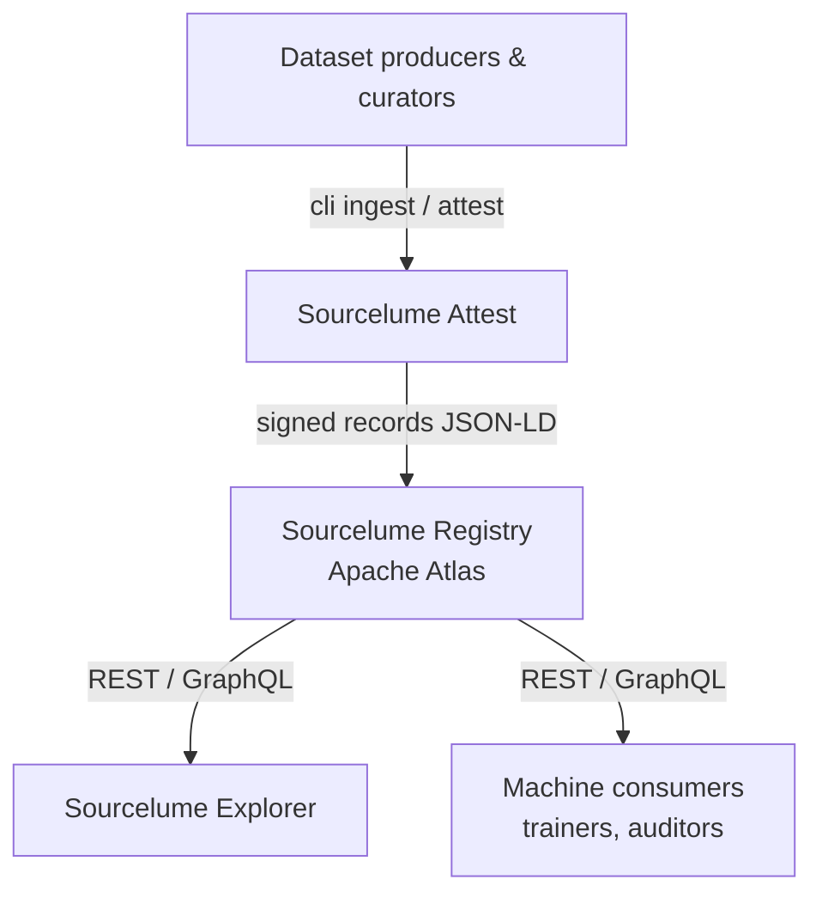

Title: About
license: https://www.apache.org/licenses/LICENSE-2.0

Apache Sourcelume is open-source instrumentation for AI training-data provenance — a
metadata specification, a reference registry, an ingestion and attestation pipeline, and
a public explorer. It lets model producers and dataset curators publish and
cryptographically sign structured records of a dataset's origin, custody chain, and
stated licensing terms, so that those claims can be independently checked.

Sourcelume does not verify, adjudicate, or certify that stated terms are accurate or
legally sufficient. It is neutral plumbing — the tooling and registry that make
consistent, verifiable documentation possible for those who choose to use it.

## Apache Sourcelume Workflow

Sourcelume builds on and aligns with existing standards rather than competing with them,
including the MIT Data Provenance Initiative, the AI Alliance's Open Trusted Data
Initiative, MLCommons Croissant, the SPDX AI Profile, and the Content Authenticity
Initiative's C2PA work. It also builds on several existing Apache projects, including
Atlas, Iceberg, Parquet, NiFi, and Airflow.
