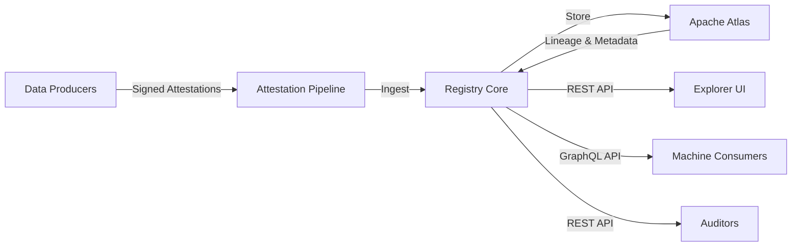
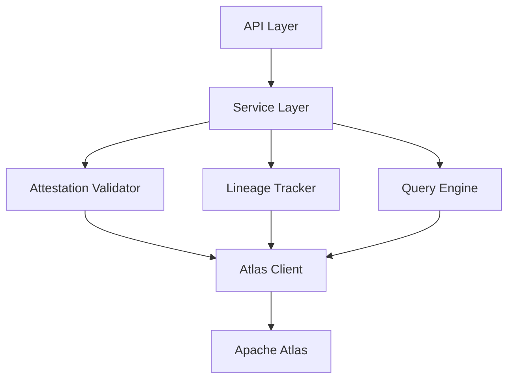

Title: Registry
license: https://www.apache.org/licenses/LICENSE-2.0

The Apache Sourcelume Registry is the central repository for signed provenance records.
It provides a stable, queryable endpoint for dataset consumers and auditors to
verify provenance claims.

## High-Level Architecture

The Registry serves as the authoritative store for AI training data provenance records. It receives signed attestations from data producers, stores them with full lineage tracking, and exposes them through modern APIs for verification and audit.



**Architecture Flow:**

1. **Data Producers** → Signed Attestations → **Attestation Pipeline**
2. **Attestation Pipeline** → Ingest → **Registry Core**
3. **Registry Core** ↔ Store/Retrieve ↔ **Apache Atlas**
4. **Registry Core** → REST API → **Explorer UI**
5. **Registry Core** → GraphQL API → **Machine Consumers**
6. **Registry Core** → REST API → **Auditors**

**Key Components:**

- **Apache Atlas Backend** — Provides robust metadata management, lineage tracking, and graph-based querying
- **Attestation Ingestion** — Validates and processes signed provenance records
- **REST & GraphQL APIs** — Dual interface for human-readable exploration and programmatic access
- **Verification Engine** — Cryptographic signature validation and chain-of-custody verification

## Detailed Architecture

### Technology Stack

The Registry is built with:

- **Java 21** — Modern Java with performance improvements and language features
- **CDI (Contexts and Dependency Injection)** — Enterprise dependency injection and lifecycle management
- **Apache Atlas** — Metadata repository with built-in lineage and governance capabilities
- **REST & GraphQL** — Dual API layer for flexible access patterns

### Core Modules



The Registry architecture consists of several layered modules:

- **API Layer** — REST and GraphQL endpoints with authentication and rate limiting
- **Service Layer** — Business logic that coordinates attestation processing, verification, and querying
- **Attestation Validator** — Cryptographic signature verification and schema validation
- **Lineage Tracker** — Manages provenance chains and dataset relationships in Atlas
- **Query Engine** — Optimized queries against Atlas for common access patterns
- **Atlas Client** — Integration layer with Apache Atlas metadata store
- **Apache Atlas** — Underlying metadata repository and lineage store

### Data Flow

1. **Ingestion Workflow**
   - Attestation arrives via REST endpoint with signature
   - Signature validated against known public keys
   - Schema validated against Sourcelume specification
   - Metadata extracted and normalized
   - Record stored in Atlas with lineage relationships
   - Confirmation returned to producer

2. **Query Workflow**
   - Consumer requests provenance for dataset identifier
   - Query engine translates to Atlas lineage query
   - Results filtered and formatted
   - Signature proofs included in response
   - Response returned via REST or GraphQL

3. **Verification Workflow**
   - Auditor submits attestation for verification
   - Registry checks signature validity
   - Lineage chain reconstructed from Atlas
   - Chain-of-custody validated
   - Verification report generated

### API Design

**REST Endpoints:**

- `POST /api/v1/attestations` — Submit new attestation
- `GET /api/v1/attestations/{id}` — Retrieve attestation by ID
- `GET /api/v1/datasets/{id}/provenance` — Get full provenance chain
- `POST /api/v1/verify` — Verify attestation signature and chain

**GraphQL Schema:**

```graphql
type Attestation {
  id: ID!
  datasetId: String!
  producer: Producer!
  signature: Signature!
  metadata: JSON!
  lineage: [Attestation!]!
}

type Query {
  attestation(id: ID!): Attestation
  datasetProvenance(datasetId: String!): [Attestation!]!
  verifyAttestation(attestationId: ID!): VerificationResult!
}
```

## Developer Setup

To contribute to the Registry or run it locally for testing, follow these steps.

### Prerequisites

- **Java 21** — Install via [SDKMAN!](https://sdkman.io/) or your package manager

```bash
  sdk install java 21.0.1-tem
```

- **Maven** — Build tool
- **Docker** — For running Apache Atlas locally
- **Git** — Version control

### Local Development Environment

1. **Clone the repository**

```bash
   git clone https://github.com/apache/sourcelume-registry.git
   cd sourcelume-registry
```

2. **Start development dependencies**

   The `dev-support` directory contains Docker Compose configurations for local testing:

```bash
   cd dev-support
   docker-compose up -d
```

   This starts:

   - Apache Atlas on `localhost:21000`
   - Kafka (Atlas dependency) on `localhost:9092`
   - Any other required services

3. **Configure CDI**

   The project uses CDI for dependency injection. Configuration files are typically in:
   - `src/main/resources/META-INF/beans.xml` — CDI bean discovery
   - `src/main/resources/application.properties` — Application configuration

   For local development, override settings:

```properties
   atlas.rest.address=http://localhost:21000
   registry.signing.verify=false  # For local testing only
```

4. **Build the project**

```bash
   mvn clean install
```

5. **Run the Registry**

```bash
   mvn quarkus:dev  # If using Quarkus
   # or
   java -jar target/sourcelume-registry-{version}.jar
```

   The Registry API will be available at `http://localhost:8080`

### Testing Against Local Registry

The `dev-support` directory includes:

- **Sample attestations** — Test data for development
- **Test scripts** — Shell scripts to submit and query test data
- **Docker profiles** — Different configurations for various scenarios

**Run integration tests:**

```text
mvn verify -Pintegration-tests
```

**Submit a test attestation:**

```text
bash curl -X POST [http://localhost:8080/api/v1/attestations](http://localhost:8080/api/v1/attestations)
-H "Content-Type: application/json"
-d @dev-support/samples/sample-attestation.json
```

**Query via GraphQL:**

```text
bash curl -X POST [http://localhost:8080/graphql](http://localhost:8080/graphql)
-H "Content-Type: application/json"
-d '{"query": "{ attestation(id: "test-123") { datasetId producer { name } } }"}'
```

### Development Tips

- **Hot Reload** — If using Quarkus, changes to Java classes are reloaded automatically in dev mode
- **Atlas UI** — Access Atlas UI at `http://localhost:21000` to browse metadata and lineage
- **Logging** — Set `quarkus.log.level=DEBUG` for verbose output during development
- **Mock Mode** — Set `registry.mock=true` to run without Atlas for rapid API testing

## Registry Repository

The Sourcelume Registry is actively developed in its own repository:

- **[apache/sourcelume-registry](https://github.com/apache/sourcelume-registry)**

Visit the repository to:

- View current implementation status
- Report issues or propose features
- Contribute code or documentation
- Join technical discussions
