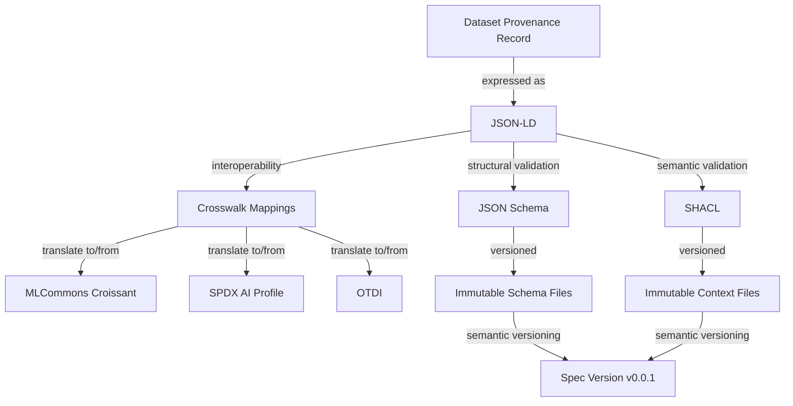

Title: Specification
license: https://www.apache.org/licenses/LICENSE-2.0

The Apache Sourcelume Specification defines a structured, machine-readable format for
representing AI training-data provenance. It allows producers and curators to
publish verifiable claims about a dataset's origin, custody, and licensing.

## Architecture

The Sourcelume Specification is designed for interoperability, verifiability, and long-term stability. Its architecture is built on several key pillars:

**Architecture Flow:**

1. **Dataset Provenance Record** → expressed as → **JSON-LD**
2. **JSON-LD** → structural validation → **JSON Schema**
3. **JSON-LD** → semantic validation → **SHACL**
4. **JSON-LD** → interoperability → **Crosswalk Mappings**
5. **Crosswalk Mappings** → translate to/from → **MLCommons Croissant**, **SPDX AI Profile**, **OTDI**
6. **JSON Schema** & **SHACL** → versioned → **Immutable Schema/Context Files**
7. **Immutable Files** → semantic versioning → **Spec Version**

**Key Components:**

- **JSON-LD Foundation**: Sourcelume records are expressed as [JSON-LD](https://json-ld.org/), providing a bridge between standard JSON and the rich semantics of the Linked Data ecosystem.
- **Structural and Semantic Validation**:
  - **JSON Schema**: Used for structural validation of records, ensuring that required fields and data formats are consistently applied.
  - **SHACL (Shapes Constraint Language)**: Used for RDF-level validation, ensuring the semantic integrity and consistency of the data across different representations.
- **Interoperability through Crosswalks**: The specification is designed to be compatible with other major industry standards. It includes "crosswalk" mappings to ensure that Sourcelume records can be translated to and from formats like:
  - **MLCommons Croissant**: For machine learning dataset descriptions.
  - **SPDX (AI Profile)**: For software and AI Bill of Materials.
  - **OTDI (Open Training Data Initiative)**: For training data transparency.
- **Immutable and Semantic Versioning**: To ensure that provenance records remain verifiable over time, the specification follows strict versioning rules:
  - **Semantic Versioning**: All changes follow `MAJOR.MINOR.PATCH` rules based on their impact on data validation.
  - **Immutability**: Once a version of the specification is released, its schema and context files are immutable. This allows tools and records to pin specific versions (e.g., `0.0.1`) with absolute confidence that the definitions will never change.

## Specification Repository

The Sourcelume Specification is currently being developed in its own repository:

- **[apache/sourcelume-spec](https://github.com/apache/sourcelume-spec)**

Please visit the repository to view the current drafts, open issues, and join the
discussion.
